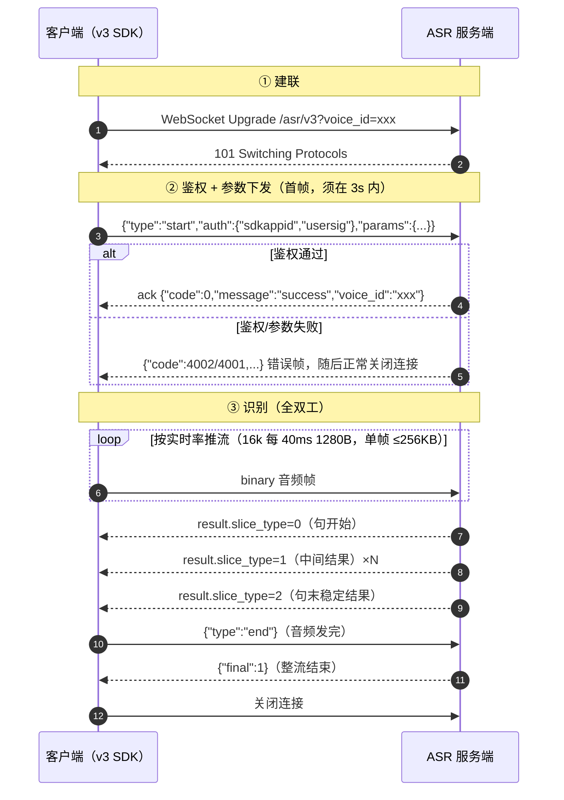
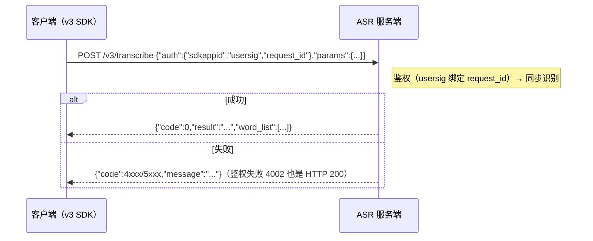
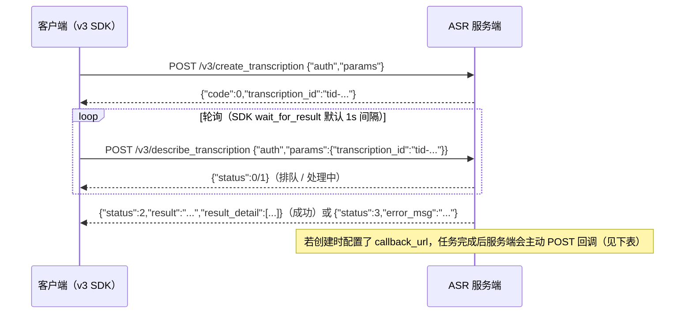

# TRTC-ASR Python SDK

> [English](./README.en.md) | 中文
基于 TRTC 鉴权体系的语音识别（ASR）Python SDK，支持实时语音识别（WebSocket）、一句话识别（HTTP）和录音文件识别（异步 HTTP）三种模式。

本 SDK 面向**新版 v3 协议**：只需 `SDKAppID` + `SecretKey`（无需腾讯云 AppID），`auth`/`params` 分块、全 snake_case、扁平响应 + 数字错误码。v3 客户端位于 `trtc_asr.v3` 子包。

> 其他语言 SDK：[Go](https://github.com/Tencent-RTC/trtc-asr-sdk-go) | [Node.js](https://github.com/Tencent-RTC/trtc-asr-sdk-nodejs) | [Java](https://github.com/Tencent-RTC/trtc-asr-sdk-java) | [Rust](https://github.com/Tencent-RTC/trtc-asr-sdk-rust) | [C++](https://github.com/Tencent-RTC/trtc-asr-sdk-cpp)
>
> **旧版协议（v2 / v1）**的完整说明与客户端（`trtc_asr` 顶层导出）见 [docs/v2_protocol.md](./docs/v2_protocol.md)。旧版客户端继续维护，存量用户无需任何改动。

## 前提条件

使用本 SDK 前，您需要准备两个凭证：`SDKAppID`、`SecretKey`。国内站与国际站的账号体系不同，请按您的站点参照官方快速接入指南完成注册、创建应用与服务开通：

- **国内站**：[快速接入指南](https://xai.cloud-rtc.com/#gettingStarted) — 注册腾讯云账号并完成实名认证 → 在 [TRTC 控制台](https://console.cloud.tencent.com/trtc/app)创建应用 → 开通「AI 智能识别」（体验版可免费试用）
- **国际站**：[Quick Start](https://xai-intl.cloud-rtc.com/#gettingStarted) — 在 [trtc.io](https://www.trtc.io) 注册（自动开通 Tencentcloud 账号，无需实名认证）→ 在 [console.trtc.io](https://console.trtc.io) 创建应用 → 开通「AI Speech Recognition」（仅 RTC Engine Lite 及以上包月套餐，Free Trial 不支持）

## 协议说明（v3）

### 接口路径

| 模式 | 路径 |
|------|------|
| 实时识别（WebSocket） | `wss://{host}/asr/v3?voice_id=<voice_id>` |
| 一句话识别 | `POST https://{host}/v3/transcribe` |
| 录音文件识别 | `POST https://{host}/v3/create_transcription` |
| 任务查询 | `POST https://{host}/v3/describe_transcription` |

`{host}` 国内站为 `asr.cloud-rtc.com`，国际站为 `asr-intl.cloud-rtc.com`（`credential.site = SITE_INTL`）。

### 鉴权与参数（auth / params 分块）

v3 把请求拆成两个正交的块，字段全程 snake_case：

- `auth`：身份与签名，由网关鉴权层消费——**在线与离线的字段不同，分别见下**。
- `params`：业务识别参数（引擎、VAD、热词、过滤等），snake_case，字段与 v2 在线 query 同名。

两块共用同一套签名规则：

- 未调用 `credential.set_user_sig()` 时，SDK 用 `SDKAppID + SecretKey` 本地生成，**有效期 86400 秒**，且每条连接 / 每次请求都重新生成——长跑服务无需自己管理过期。
- 调用 `credential.set_user_sig(sig)` 传入固定签名后，SDK **不再生成也不再刷新**：服务端用当前 identifier（在线 `voice_id`、离线 `request_id`）验签，因此签名必须用同一个 identifier 签发；固定签名场景（如浏览器端由业务后端下发签名）需自行处理过期与 identifier 对齐。
- 签名与站点绑定：`credential.set_site(SITE_INTL)` 决定 host 和验签集群，国际站的凭证不要用于国内站（反之亦然）。
- `SecretKey` 不会传输到网络，签名只用于服务端验签。

#### 在线（流式）鉴权

一条 WebSocket 连接 = 一条流，`voice_id` 既是流身份、也是签名 identifier（URL 与 `params` 都带它，`auth` 块里不再重复）。

| 字段 | 类型 | 必填 | 说明 |
|------|------|------|------|
| `sdkappid` | string | 是 | TRTC 应用 ID，取自 credential，SDK 自动填写 |
| `usersig` | string | 是 | TRTC 签名，identifier = 当前 `voice_id`（SDK 按该值签发） |

- **在线没有 `request_id`**：request_id 是离线「一次请求 = 一个事务」的概念（见下），流式协议里不存在。
- `voice_id` 同时出现在 URL `?voice_id=` 与 `params.voice_id`（两者一致或省略），≤128 字符；SDK 默认生成 uuid，可用 `set_voice_id` 指定；与活跃流冲突会返回 `4001`。
- 一条流一个签名，随连接生成；重连即重签，不需要自己维护有效期。

WebSocket 建连后 **3 秒内**发送首帧 JSON：

```json
{
  "type": "start",
  "auth": {"sdkappid": "1400000001", "usersig": "eJw..."},
  "params": {"engine_model_type": "bigmodel", "language": "zh", "voice_format": 1, "needvad": 1}
}
```

鉴权通过后服务端回 `{"code":0,"message":"success","voice_id":"..."}`，之后上行 binary 音频帧、结束发 `{"type":"end"}`。SDK 的 `start()` 会**同步等待这个 ack**，鉴权/参数错误直接从 `start()` 抛出。

#### 离线（HTTP）鉴权

每次 HTTP 请求是一个独立事务，`request_id` 既是单次请求 ID、也是签名 identifier（调用方无需自己生成）。

| 字段 | 类型 | 必填 | 说明 |
|------|------|------|------|
| `sdkappid` | string | 是 | TRTC 应用 ID，取自 credential，SDK 自动填写 |
| `usersig` | string | 是 | TRTC 签名，identifier = 本次请求的 `request_id`（SDK 按该值签发） |
| `request_id` | string | 是 | 单次请求 ID，SDK 每次请求自动生成 uuid；响应原样回显、`callback_url` 回调也会带回，是离线对账与排障的钥匙（SDK 不支持自定义） |

HTTP POST body 为对称的 `{"auth":{...},"params":{...}}`，响应扁平化（无 `Response` 外壳）：

```json
{"code": 0, "message": "success", "request_id": "req-uuid", "result": "识别文本", "audio_duration": 1234}
```

> **注意**：v3 离线鉴权失败是 HTTP 200 + `{"code":4002}`，判断结果请以 body 的 `code` 为准（SDK 已处理，`code != 0` 会抛出携带该 code 的 `ASRError`）。

### 在线交互流程（建联 → 鉴权 → 识别）



> SDK 行为对应：`start()` = ①+②（同步等 ack，失败立即抛错）；`write()` = ③上行；下行经 listener 回调（`on_sentence_begin` / `on_recognition_result_change` / `on_sentence_end` / `on_recognition_complete`）；`stop()` = 发 `end` 并等 `final:1`。空闲保护：15s 未发音频服务端会以 `4008` 断连。

### 在线首帧参数（params）

`needvad` / `vad_silence_time` / `vad_level` / `input_sample_rate` / `convert_num_mode` / `filter_empty_result` / `noise_threshold` 为可选三态字段：未传走服务端缺省，显式传 `0` 有业务含义（v2 的 query 传参会吞掉显式 0，v3 已修正）。

| 参数 | 类型 | 默认 | 说明 |
|------|------|------|------|
| `voice_id` | string | 取 URL | 流唯一标识（≤128 字符），与 URL 一致或省略 |
| `engine_model_type` | string | **必填** | 引擎模型，无默认值，必填；示例取 `bigmodel`（推荐，配 `language`） |
| `language` | string | 空 | 识别语言（`zh`/`en`/`ja`…），空=自动检测；`bigmodel` 建议显式指定（如 `zh`） |
| `voice_format` | int | `1` | 音频格式：`1`pcm/`4`speex/`6`silk/`8`mp3/`10`opus/`11`ogg/`12`wav/`14`m4a/`16`aac |
| `input_sample_rate` | int | 不传 | 仅 `8000`：声明 8k PCM 输入，配 16k 引擎升采样 |
| `needvad` | int | 引擎相关 | `0` 关 / `1` 开 VAD |
| `vad_silence_time` | int | `800` | 断句静音阈值（ms），`needvad=1` 时范围 240~2000 |
| `vad_level` | int | `1` | VAD 场景档：`0` 高召回 / `1` 远场过滤 |
| `noise_threshold` | float | 不传 | 噪声阈值 `0`~`4`，设置后覆盖 `vad_level` 档 |
| `max_speak_time` | int | `60000` | 强制断句时长（ms），范围 5000~90000 |
| `filter_dirty` | int | `0` | 脏词：`0` 不过滤 / `1` 过滤 / `2` 替换为 * |
| `filter_modal` | int | `0` | 语气词：`0` 不过滤 / `1` 部分 / `2` 严格 |
| `filter_punc` | int | `0` | 句末标点：`0` 不过滤 / `1` 过滤 |
| `filter_empty_result` | int | `1` | 空结果：`0` 下发 / `1` 不下发 |
| `convert_num_mode` | int | `1` | 数字转换：`0` 不转 / `1` 智能 / `3` 数学 |
| `word_info` | int | `0` | 词级时间戳：`0` 关 / `1` 开 / `2` 含标点 / `100` 字幕模式 |
| `word_with_space` | int | `0` | 英文单词间空格输出 |
| `hotword_id` | string | 空 | 热词表 ID（SDKAppID 维度） |
| `hotword_list` | string | 空 | 临时热词：`词\|权重` 逗号分隔，词 ≤30 字符，权重 1~11 或 100 |
| `speaker_diarization` | int | `0` | 说话人分离：`0` 关 / `1` 匿名聚类 / `3` 声纹角色认证 |
| `speaker_number` | int | `0` | 说话人数量提示，`0` 自动检测 |
| `voiceprint_ids` | []string | 空 | 已注册声纹 ID（仅 `speaker_diarization=3`） |
| `speaker_roles` | []object | 空 | 临时声纹：`[{"audio_url":"...","role_name":"..."}]`（仅模式 3），`role_name` 会回显到结果 |
| `context` | object | 空 | 识别上下文：`{"text":"背景文本","terms":["术语"],"general":[{"key":"domain","value":"Meeting"}]}` |

> `context` 消费方式与引擎能力相关：大模型类引擎可用 `text`/`terms`/`general`，传统引擎仅把 `terms` 降级为热词。`speaker_diarization=1/3` 时服务端会强制开启 VAD 并调整 `word_info`。

### 在线响应

下行消息结构与 v2 完全一致（`code` / `message` / `voice_id` / `message_id` / `result` / `final`）：

| 字段 | 类型 | 说明 |
|------|------|------|
| `code` / `message` | Integer / String | 错误码与提示，`0` 表示成功 |
| `voice_id` / `message_id` | String | 音频流 ID / 单条消息 ID |
| `final` | Integer | `1` 表示会话结束包 |
| `result.slice_type` | Integer | `0` 句子开始，`1` 中间结果，`2` 句末稳定结果 |
| `result.index` | Integer | 句子序号 |
| `result.start_time` / `end_time` | Integer | 当前结果起止时间（ms） |
| `result.voice_text_str` | String | 当前结果文本 |
| `result.word_size` / `word_list` | Integer / Array | 词级（字级）时间戳，需 `word_info != 0` |
| `result.speaker_segments` | Array | 说话人分段，开启说话人分离后返回 |
| `result.language` | String | 识别语言（引擎上报时） |
| `result.finish_silence_ms` | Integer | 触发断句的尾部静音时长（ms） |
| `result.last_token_runtime_ms` | Integer | 末字服务端解码耗时（ms） |

### 一句话识别 /v3/transcribe



`params` 字段：

| 参数 | 类型 | 必填 | 说明 |
|------|------|------|------|
| `engine_model_type` | string | 是 | 引擎模型，必填；示例取 `bigmodel`（推荐，配 `language`） |
| `source_type` | int | 是 | `0` URL 上传 / `1` 本地数据（base64） |
| `voice_format` | string | 是 | 音频格式：`wav`、`pcm`、`ogg-opus`、`mp3`、`m4a` |
| `url` | string | 条件 | 音频 URL（`source_type=0` 必填） |
| `data` | string | 条件 | base64 音频数据（`source_type=1` 必填） |
| `data_len` | int | 条件 | 音频数据原始长度（`source_type=1` 必填） |
| `word_info` | int | 否 | 词级时间：`0` 关 / `1` 开 / `2` 含标点 |
| `filter_dirty` | int | 否 | 脏词过滤：`0` / `1` / `2`(替换 *) |
| `filter_modal` | int | 否 | 语气词过滤：`0` / `1` / `2` |
| `filter_punc` | int | 否 | 标点过滤：`0` 不过滤 / `1` 过滤 |
| `convert_num_mode` | int | 否 | 数字转换：`0` 不转 / `1` 智能 / `3` 数学 |
| `hotword_id` | string | 否 | 热词表 ID |
| `customization_id` | string | 否 | 自学习模型 ID |
| `hotword_list` | string | 否 | 临时热词列表 |
| `input_sample_rate` | int | 否 | PCM 输入采样率（仅 8000，配 16k 引擎升采样） |
| `needvad` | int | 否 | 三态：不传走默认，`0` 关 / `1` 开 |
| `vad_silence_time` | int | 否 | 三态：不传走默认（800），断句静音阈值（ms） |
| `language` | string | 否 | 指定识别语言，留空自动检测 |
| `speaker_diarization` | int | 否 | 说话人分离：`0` 关 / `1` 聚类 / `3` 声纹角色 |
| `speaker_number` | int | 否 | 说话人数量提示，`0` 自动 |
| `context` | object | 否 | 识别上下文（结构同在线） |

**限制**：音频时长 ≤ 60s，文件大小 ≤ 3MB。

响应（`TranscribeResponse`）：

| 字段 | 类型 | 说明 |
|------|------|------|
| `code` / `message` / `request_id` | int / string / string | 状态码 / 提示 / 请求 ID |
| `result` | string | 识别结果文本 |
| `audio_duration` | int | 音频时长（ms） |
| `language` / `language_b47` | string | 识别语言 |
| `word_size` / `word_list` | int / array | 词级结果，`word_list[]` 含 `word` / `start_time` / `end_time`（ms） |

### 录音文件识别 /v3/create_transcription

异步任务：创建返回 `transcription_id`（24 小时有效），再用任务查询接口轮询。



`params` 字段：

| 参数 | 类型 | 必填 | 说明 |
|------|------|------|------|
| `engine_model_type` | string | 是 | 引擎模型，必填；示例取 `bigmodel`（推荐，配 `language`） |
| `channel_num` | int | 是 | 声道数：`1` 单声道；`2` 双声道（按 `channel_id` 出句，勿与分离同开） |
| `res_text_format` | int | 是 | 结果格式：`0` 基础 / `1` 含词级时间 / `2` 含标点时间 |
| `source_type` | int | 是 | `0` URL 上传 / `1` 本地数据（base64） |
| `url` | string | 条件 | 音频 URL（`source_type=0`，时长 ≤12h，大小 ≤1GB） |
| `data` / `data_len` | string / int | 条件 | base64 音频与原始长度（`source_type=1`，≤5MB） |
| `audio_urls` | array | 否 | 分布式录音：`[{"index":0,"url":"...","label":"..."}]` |
| `callback_url` | string | 否 | 结果回调 URL（任务完成后 POST） |
| `speaker_diarization` | int | 否 | 说话人分离：`0` 关 / `1` 聚类 / `3` 声纹角色 |
| `speaker_number` | int | 否 | 说话人数量提示 |
| `voiceprint_ids` | array | 否 | 已注册声纹 ID（仅模式 3） |
| `speaker_roles` | array | 否 | 临时声纹 `[{"audio_url","role_name"}]`（仅模式 3） |
| `hotword_id` | string | 否 | 热词表 ID |
| `customization_id` | string | 否 | 自学习模型 ID |
| `hotword_list` | string | 否 | 临时热词列表 |
| `keyword_lib_id_list` | array | 否 | 关键词库 ID 列表 |
| `replace_text_id` | string | 否 | 替换词表 ID |
| `convert_num_mode` | int | 否 | 数字转换 |
| `filter_dirty` / `filter_punc` / `filter_modal` | int | 否 | 过滤类 |
| `sentence_max_length` | int | 否 | 单句最大长度 |
| `extra` | string | 否 | 引擎扩展串 |
| `vad_silence_ms` | int | 否 | 静音断句阈值（ms） |
| `vad_level` | int | 否 | VAD 场景档：`0` 高召回 / `1` 远场过滤 |
| `noise_threshold` | float | 否 | 噪声阈值 `0`~`4`（`0` 是合法取值，用 `None` 区分未设置） |
| `language` | string | 否 | 指定识别语言，留空自动检测 |
| `context` | object | 否 | 识别上下文（结构同在线） |

响应：`{"code":0,"message":"success","request_id":"...","transcription_id":"..."}`。

`callback_url` 回调（`application/x-www-form-urlencoded`，snake_case 字段）：

| 字段 | 说明 |
|------|------|
| `code` / `message` | `0` 成功 / 失败原因 |
| `request_id` | 创建时 `auth.request_id` 原值 |
| `transcription_id` | 任务 ID |
| `text` / `audio_duration` | 成功时：全文 / 时长（秒） |
| `audio_url` | 音频地址（存在且允许回传时） |
| `result_detail` | JSON 字符串，分句结构同任务查询响应 |

### 任务查询 /v3/describe_transcription

`params` 仅一个字段：`transcription_id`（创建任务返回的 ID；与 v1 `RecTaskId` 不通用）。

响应（`TranscriptionStatus`）：

| 字段 | 类型 | 说明 |
|------|------|------|
| `code` / `message` / `request_id` | — | 状态码 / 提示 / 请求 ID |
| `transcription_id` | string | 任务 ID |
| `status` / `status_str` | int / string | `0` 排队 / `1` 处理中 / `2` 成功 / `3` 失败 |
| `progress` | int | 处理进度（0-100） |
| `audio_duration` | float | 音频时长（秒） |
| `result` | string | 完整识别文本 |
| `result_detail` | array | 分句结果（见下） |
| `error_msg` | string | 失败原因 |

`result_detail[]`（`SentenceDetail`）：

| 字段 | 类型 | 说明 |
|------|------|------|
| `final_sentence` / `slice_sentence` / `written_text` | string | 终稿句 / 分片句 / 书面文本 |
| `start_ms` / `end_ms` | int | 句起止时间（ms） |
| `words_num` / `words` | int / array | 词级结果；`words[]` 含 `word` / `start_time` / `end_time` |
| `speech_speed` | float | 语速 |
| `speaker_id` | int | 说话人编号（开启分离后返回） |
| `channel_id` | int | 双声道场景声道编号：1=左、2=右 |
| `speaker_role_name` | string | 角色名（模式 3 命中声纹时返回） |
| `silence_time` | int | 句前静音（ms） |
| `language` / `language_b47` | string | 该句识别语言 |

### 错误码

| code | 说明 | 常见触发 |
|------|------|----------|
| `4000` | 音频发送过多 | 1 秒内最多发送 3 秒音频 |
| `4001` | 参数不合法 | params 校验失败 / `voice_id` 冲突 |
| `4002` | 鉴权失败 | `auth` 缺失 / `usersig` 验签不通过 / 查询他人任务 |
| `4003` | 服务未开通 | 调度拒绝 |
| `4006` | 并发超限 | 账号并发或连接数超限 |
| `4007` | 音频解码失败 | 音频与 `voice_format` 不符 |
| `4008` | 超时 | 在线 15s 未发音频 / 首帧 3s 超时 |
| `4010` | 未知文本消息 | 首帧 JSON 非法 / `type` 非 `start` |
| `5000`/`5001`/`5002` | 服务端内部错误 | 无可用机器 / 调度失败，可重试 |

离线接口的 HTTP 状态码与 `code` 组合：参数错误 `400`、鉴权失败 **`200`**、并发超限 `429`、body 过大 `413`、调度失败 `503`——**一律以 body 的 `code` 为准**。

### 说话人分离（实时）

开启 `speaker_diarization` 后，说话人归属通过两个入口返回：

- `result.speaker_segments[]`：**推荐入口**。一个 `result` 可能包含多个说话人，句子级归属天然有歧义，因此协议按说话人切段返回。`len(speaker_segments) == 1` 即为单说话人句。
- `result.word_list[].speaker_id`：字级归属，需同时设置 `word_info != 0`。

`speaker_id` 语义：会话内有效，从 `1` 开始编号，`-1` 表示未知，`0` 为保留值。

`speaker_segments[]` 字段：

| 字段 | 类型 | 说明 |
|------|------|------|
| `speaker_id` | Integer | 说话人编号 |
| `speaker_name` | String | 角色名，仅 `speaker_diarization=3` 命中注册声纹时返回，等于请求侧 `RoleName` |
| `start_time` / `end_time` | Integer | 该分段起止时间（ms） |
| `text` | String | 该分段文本 |
| `word_start` / `word_end` | Integer | 对应 `word_list` 的闭区间下标，即 `word_list[word_start:word_end+1]`；`word_info=0` 时不返回 |
| `stable_flag` | Integer | 该分段是否稳定：`1` 稳定，`0` 非稳定 |

Python 用法示例：

```python
from trtc_asr.v3 import (
    SPEAKER_DIARIZATION_CLUSTER,
    SPEAKER_DIARIZATION_VOICEPRINT,
    SpeakerRole,
    SpeechRecognitionListener,
    SpeechRecognizer,
)

recognizer = SpeechRecognizer(credential, "bigmodel", listener)
recognizer.set_language("zh")                                    # bigmodel 建议显式指定语种
recognizer.set_word_info(1)                                      # 需要字级说话人时开启
recognizer.set_speaker_diarization(SPEAKER_DIARIZATION_CLUSTER)  # 1：匿名聚类

# 声纹角色认证（返回角色名）：
# recognizer.set_speaker_diarization(SPEAKER_DIARIZATION_VOICEPRINT)  # 3
# recognizer.set_speaker_roles([
#     SpeakerRole(role_name="teacher", audio_url="https://example.com/teacher.wav"),
# ])
# recognizer.set_voiceprint_ids(["vp-1"])  # 已注册声纹
# recognizer.set_speaker_number(2)         # 0 = 自动检测；两种分离模式都生效

# 回调里读取：
class MyListener(SpeechRecognitionListener):
    def on_sentence_end(self, resp):
        for seg in resp.result.speaker_segments:
            name = seg.speaker_name or "spk{}".format(seg.speaker_id)
            print(f"[{name}] {seg.text}")
```

### VAD 调优（noise_threshold / vad_level）

| 方法 | 取值 | 说明 |
|------|------|------|
| `set_vad_level(level)` | `0` / `1` | `0` 高召回，`1` 远场过滤（服务端默认） |
| `set_noise_threshold(v)` | `0.0` - `4.0` | 噪声抑制微调，值越大抑制越强、召回越低；设置后覆盖 `vad_level` 档位 |
| `set_vad_silence_time(ms)` | 240 - 2000 | 静音断句阈值 |

两者都是三态语义：**只有显式调用 setter 才会下发**，因此显式传 `0` 与「不配置」可以区分（服务端 `vad_level` 默认是 `1`）。超出范围会在 `start()` 阶段本地报错，不会浪费一次连接。

## 安装

```bash
pip install trtc-asr
```

**要求**：Python >= 3.8

## 快速开始

### 实时语音识别（asyncio）

```python
import asyncio

from trtc_asr.v3 import SpeechRecognizer, SpeechRecognitionListener


class MyListener(SpeechRecognitionListener):
    def on_sentence_end(self, resp):
        print(f"Sentence end: {resp.result.voice_text_str}")

    def on_fail(self, resp, error):
        print(f"Failed: {error}")  # ASRError，code 即服务端错误码（4001/4002/...）


async def main():
    # 1. 创建凭证（第一个参数是 SDKAppID；v3 不需要腾讯云 AppID）
    from trtc_asr import SITE_INTL
    from trtc_asr.v3 import new_credential
    credential = new_credential(1400000000, "your-sdk-secret-key")
    # credential.site = SITE_INTL  # 国际站；不设置则走国内站

    # 2. 创建识别器
    recognizer = SpeechRecognizer(credential, "bigmodel", MyListener())
    recognizer.set_language("zh")  # bigmodel 建议显式指定语种

    # 3. 启动识别（同步等待服务端 ack；鉴权/参数错误在这里抛出）
    await recognizer.start()

    # 4. 发送音频数据
    with open("audio.pcm", "rb") as f:
        while chunk := f.read(6400):  # 200ms of 16kHz 16bit mono PCM
            await recognizer.write(chunk)
            await asyncio.sleep(0.2)  # 模拟实时

    # 5. 停止识别（发送 {"type":"end"} 并等待 final）
    await recognizer.stop()


asyncio.run(main())
```

### 一句话识别

```python
from trtc_asr.v3 import SentenceRecognizer, TranscribeRequest, new_credential

credential = new_credential(1400000000, "your-sdk-secret-key")
recognizer = SentenceRecognizer(credential)

with open("audio.pcm", "rb") as f:
    resp = recognizer.recognize_data_with_options(
        f.read(),
        TranscribeRequest(engine_model_type="bigmodel", voice_format="pcm", language="zh"),
    )

print(resp.result, resp.audio_duration, resp.word_list)
```

### 录音文件识别

```python
from trtc_asr.v3 import CreateTranscriptionRequest, FileRecognizer, new_credential

credential = new_credential(1400000000, "your-sdk-secret-key")
recognizer = FileRecognizer(credential)

task_id = recognizer.create_task(CreateTranscriptionRequest(
    engine_model_type="bigmodel", channel_num=1, res_text_format=1,
    source_type=0, url="https://example.com/audio.wav", language="zh"))
status = recognizer.wait_for_result(task_id)  # 轮询直至完成

print(status.result, status.audio_duration, status.result_detail)
```

## 凭证获取

| 参数 | 国内站 | 国际站 | 说明 |
|------|--------|--------|------|
| `SDKAppID` | [TRTC 控制台](https://console.cloud.tencent.com/trtc/app) > 应用管理 | [console.trtc.io](https://console.trtc.io) > 应用详情 | TRTC 应用 ID |
| `SecretKey` | [TRTC 控制台](https://console.cloud.tencent.com/trtc/app) > 应用概览 > SDK密钥 | [console.trtc.io](https://console.trtc.io) > 应用详情 | 用于生成 UserSig，不会传输到网络 |

> v2 客户端需要的腾讯云 `AppID`（CAM 密钥管理 / 国际站账号信息页）在 v3 下不再需要。

## 配置项

实时语音识别（`SpeechRecognizer`）：

| 方法 | 说明 | 默认值 |
|------|------|--------|
| `set_voice_format(f)` | 音频格式 | 1 (PCM) |
| `set_need_vad(v)` | 是否开启 VAD | 1 (开启) |
| `set_convert_num_mode(m)` | 数字转换模式 | 1 (智能) |
| `set_hotword_id(id)` | 热词表 ID | - |
| `set_hotword_list(list)` | 临时热词列表 `词\|权重,...` | - |
| `set_filter_dirty(m)` | 脏词过滤 | 0 (关闭) |
| `set_filter_modal(m)` | 语气词过滤 | 0 (关闭) |
| `set_filter_punc(m)` | 句号过滤 | 0 (关闭) |
| `set_filter_empty_result(m)` | 空结果是否回调 | 1 (不回调) |
| `set_word_info(m)` | 词级/字级时间 | 0 (关闭) |
| `set_word_with_space(m)` | 英文单词间空格 | 0 (关闭) |
| `set_vad_silence_time(ms)` | VAD 静音阈值（240-2000） | 800ms |
| `set_vad_level(level)` | VAD 场景档：0 高召回 / 1 远场过滤 | 1 |
| `set_noise_threshold(v)` | VAD 噪声微调（0.0-4.0），覆盖场景档 | 未设置 |
| `set_max_speak_time(ms)` | 强制断句时间（5000-90000） | 60000ms |
| `set_input_sample_rate(r)` | 输入 PCM 采样率，仅 8000 | - |
| `set_speaker_diarization(m)` | 说话人分离：0 关 / 1 聚类 / 3 声纹角色 | 0 (关闭) |
| `set_speaker_number(n)` | 说话人数量提示（分离开启时生效） | 0 (自动) |
| `set_speaker_roles(roles)` | 临时声纹角色（仅模式 3，`SpeakerRole(role_name, audio_url)`） | - |
| `set_voiceprint_ids(ids)` | 已注册声纹 ID（仅模式 3） | - |
| `set_language(lang)` | 指定识别语言 | 自动检测 |
| `set_voice_id(id)` | 自定义 voice_id | 自动 UUID |
| `set_context(ctx)` | 识别上下文（`Context(text, terms, general)`） | - |

## 引擎模型

| 类型 | 说明 |
|------|------|
| `bigmodel` | 大模型引擎，推荐；配合 `language` 指定语种（如 `zh`） |
| `8k_zh` | 中文通用，常用于电话场景 |
| `16k_zh` | 中文通用 |
| `16k_zh_en` | 中英文通用 |

> `bigmodel` 的 `language` 不只是提示：服务端按它选择后端模型（`zh` 走自研大模型，留空走通用链路）。示例默认 `bigmodel` + `zh`。

## 示例

完整示例请参见：

- **实时语音识别（v3）**：[`examples/v3_realtime_asr.py`](./examples/v3_realtime_asr.py)
- **一句话识别（v3）**：[`examples/v3_sentence_asr.py`](./examples/v3_sentence_asr.py)
- **录音文件识别（v3）**：[`examples/v3_file_asr.py`](./examples/v3_file_asr.py)
- **实时语音识别（v2）**：[`examples/realtime_asr.py`](./examples/realtime_asr.py)
- **一句话识别（v2）**：[`examples/sentence_asr.py`](./examples/sentence_asr.py)
- **录音文件识别（v2）**：[`examples/file_asr.py`](./examples/file_asr.py)

```bash
python examples/v3_realtime_asr.py -f examples/test.pcm -e bigmodel
```

## 项目结构

```
trtc-asr-sdk-python/
├── trtc_asr/                   # 包源码
│   ├── credential.py           # 凭证管理（v2/v3 共用）
│   ├── usersig.py              # TRTC UserSig 生成
│   ├── signature.py            # v2 URL 请求参数构建
│   ├── speech_recognizer.py    # v2 实时语音识别器
│   ├── sentence_recognizer.py  # v2 一句话识别器
│   ├── file_recognizer.py      # v2 录音文件识别器
│   ├── errors.py               # 错误定义（共用）
│   └── v3/                     # v3 协议客户端（独立实现）
│       ├── wire.py             # wire 类型（auth/params/扁平响应，全 snake_case）
│       ├── speech_recognizer.py  # /asr/v3 首帧协议
│       ├── sentence_recognizer.py  # /v3/transcribe
│       └── file_recognizer.py  # /v3/create_transcription + describe
├── docs/
│   └── v2_protocol.md          # v2 / v1 旧版协议与客户端文档
├── examples/                   # 示例代码
├── tests/                      # 测试（含 v3 mock server 端到端 wire 测试）
├── pyproject.toml
└── README.md
```

## 常见问题

### v3 和 v2 怎么选？

- **新接入**：推荐 v3（`trtc_asr.v3` 子包）——只需 SDKAppID + SecretKey，协议更干净（auth/params 分块、扁平响应、数字错误码），`start()` 同步返回鉴权/参数错误。
- **存量**：v2（`trtc_asr` 顶层导出）继续全量可用，无需任何改动。

### 错误码怎么看？

SDK 本地错误码是 10xx（如 `1001` 参数错误）；服务端返回的是 4xxx/5xxx（如 `4002` 鉴权失败）。`ASRError.code` 的值域不冲突，可直接按区间判断来源。

### v1 的任务 ID 能用 v3 接口查询吗？

不能。v1 `RecTaskId` 与 v3 `transcription_id` 是两套任务空间，互不通用。

### 旧版 v2 / v1 协议在哪？

`trtc_asr` 顶层导出的 v2 / v1 客户端继续维护，文档见 [docs/v2_protocol.md](./docs/v2_protocol.md)。v2 与 v3 的下行消息结构一致，
listener 用法相同，切换协议版本只需改 import 与构造方式。

### UserSig 是什么？

UserSig 是基于 SDKAppID 和 SDK 密钥计算的签名，用于 TRTC 服务鉴权。SDK 会自动生成（identifier 在线绑定
`voice_id`、离线绑定 `request_id`），无需手动计算。详见[鉴权文档](https://cloud.tencent.com/document/product/647/17275)。

### 支持哪些音频格式？

- **实时语音识别**：支持 PCM 格式（`voice_format=1`），建议 16kHz、16bit、单声道
- **一句话识别**：支持 wav、pcm、ogg-opus、mp3、m4a，音频时长 ≤ 60s，文件 ≤ 3MB
- **录音文件识别**：支持 wav、ogg-opus、mp3、m4a，本地文件 ≤ 5MB，URL ≤ 1GB / ≤ 12h

## License

MIT License
